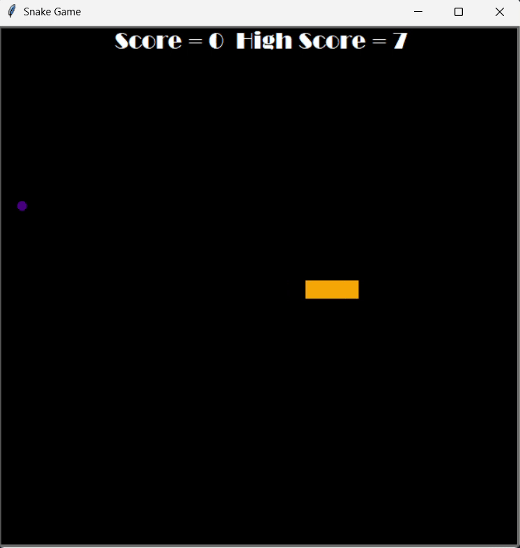

# 🐍 Snake Game (Python Turtle)

A classic Snake Game built using Python's `turtle` graphics module. Eat the food, grow the snake, and beat your high score—but don’t hit the walls or your own tail!

---

## 🎮 Demo

---

## 🚀 Features

- Classic snake movement using arrow keys
- Random food generation
- Score tracking with real-time updates
- High score saved to file (`Data.txt`)
- Collision detection:
  - With walls
  - With self (tail)
- Snake resets when collisions occur, high score persists
- Modular code using OOP (Object-Oriented Programming)

---

## 🧠 How It Works

### `main.py`

- Sets up the screen using `turtle.Screen()`
- Creates instances of the `Snake`, `Food`, and `Scoreboard` classes
- Listens to arrow key inputs to control the snake

#### Main game loop:
- Updates screen at each frame
- Moves the snake forward
- Detects collision with:
  - **Food** → grows snake, updates score
  - **Wall or tail** → resets snake and score (retains high score)

---

### `snake.py`

Handles everything about the snake:

- Snake is made up of segments (`Turtle` objects)
- Manages:
  - Movement logic
  - Extending the snake
  - Directional input (up, down, left, right)
  - Resetting snake position after collision

---

### `food.py`

Manages the food logic:

- Food is a small, randomly-placed `Turtle` object
- On eating food:
  - Moves to a new random location
  - Triggers snake to grow

---

### `score_board.py`

Displays and manages the score:

- Inherits from `Turtle`
- Tracks:
  - Current score
  - High score (loaded from and saved to `Data.txt`)
- Updates the display when score changes or game resets

---

## 💾 High Score Persistence

The `score_board.py` reads and writes the highest score from `Data.txt`.

If the current score exceeds the high score, it automatically updates the file.

> ✅ **Ensure a `Data.txt` file exists in the project directory with a number inside (e.g., `0`).**

---

## 🕹 Controls

| Key      | Action    |
|----------|-----------|
| `Up`     | Move Up   |
| `Down`   | Move Down |
| `Left`   | Move Left |
| `Right`  | Move Right|

---

## 🔧 Requirements

- Python 3.x
- No external libraries needed  
  *(Uses Python's built-in `turtle` and `random` modules)*
